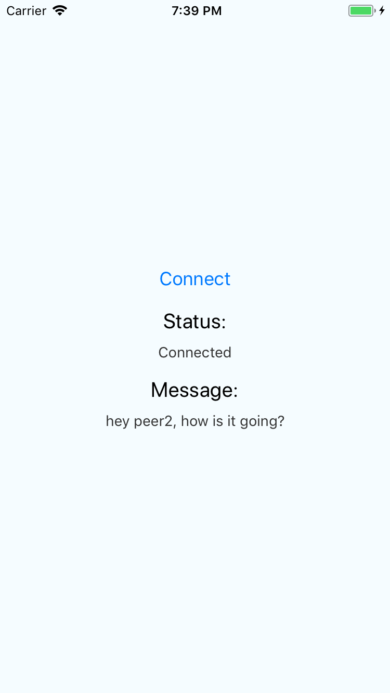
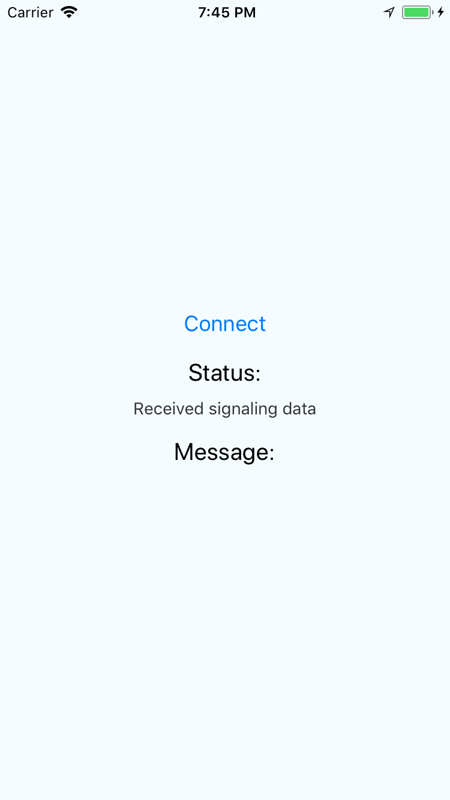
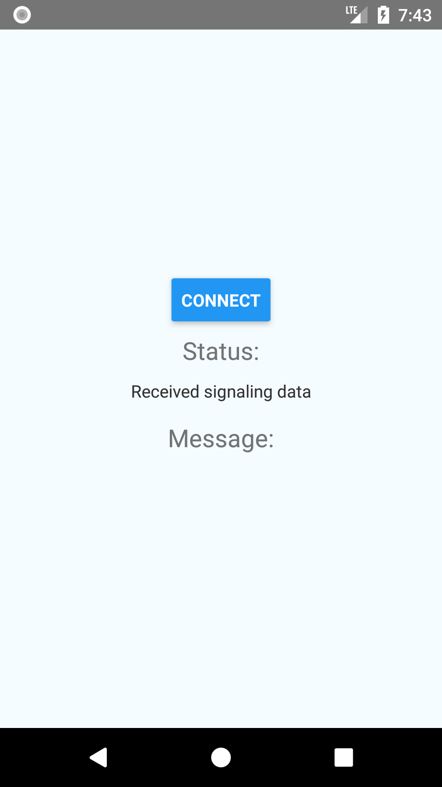

# SimplePeerDemo

Use the connect button to create two peers, and attempt to create a connection between them and send a data message.

## Setup

1. Run `yarn` to install dependencies
1. If testing Android, spin up an Android emulator first (for example `emulator @Pixel_API_26`)
1. To test iOS, run `react-native run-ios`. Or for Android, `react-native run-android`.
1. Press the Connect button to start the test. Optionally connect Chrome debugger (Cmd+D for iOS, or Cmd+M on Android, then select Debug Remotely), for additional details in console.

## Screenshots

Results on iOS using locally patched version of simple-peer:

Results on iOS using regular simple-peer:

Results on Android, using either version of simple-peer:

